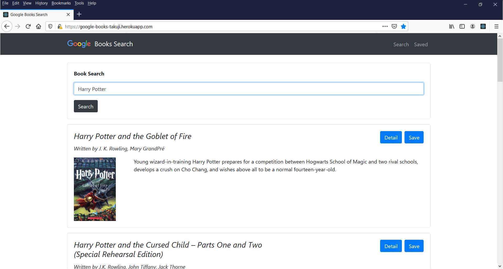

# Google Books Search :blue_book: :mag_right:

This is a React-based Google Books Search app. A user can search and save books to consider which one to puchase  later. 

 

## Live demo :earth_asia:
The application has been deployed to heroku. 

https://google-books-takuji.herokuapp.com/

## Functionalities

 * This application provides two pages:

   * Search - User can search for books via the Google Books API and render them here. User has the option to "View" a book, bringing them to the book on Google Books, or "Save" a book, saving it to the Mongo database.

   * Saved - Renders all books saved to the Mongo database. User has an option to "View" the book, bringing them to the book on Google Books, or "Delete" a book, removing it from the Mongo database.

## React  :atom_symbol:
[React Hooks](https://reactjs.org/docs/hooks-intro.html) useState, useEffect are used to implement it without Class. 

## Future Development

* Use React routing and [socket.io](http://socket.io) to create a notification or a component that triggers whenever a user saves an book. A message should include the title of the saved book.

  * Say you have multiple browsers open, each one visiting your site. If you save an book in one browser, then all of your browsers should notify you that a new book was saved.

  * [Socket.io NPM package](https://www.npmjs.com/package/socket.io)

* Use "[Proxying API Requests in Development](https://create-react-app.dev/docs/proxying-api-requests-in-development/)" for development environment.

* Replace JavaScript `alert()` with Bootstrap [modal](https://getbootstrap.com/docs/4.0/components/modal/). Use react [context](https://reactjs.org/docs/context.html) to update a message in Modal component. Refer to [`useContext()`](https://reactjs.org/docs/hooks-reference.html#usecontext).

## Technolgies
Following technologies are used for this application.

* [React](https://reactjs.org/), [Bootstrap](https://getbootstrap.com/)
* [Node.js](https://nodejs.org), [Express](https://expressjs.com/), [MongoDB](https://www.mongodb.com/)

## Credit 
* Book data is provided by [Google Books API](https://developers.google.com/books).
